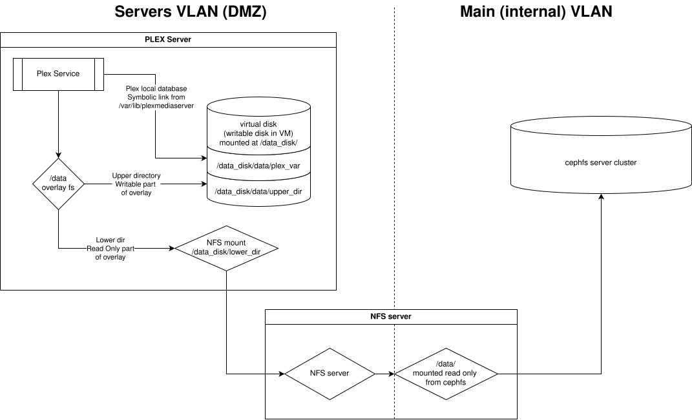

# A smarter (and safer) Plex installation

## How I originally deployed Plex

Originally plex got installed on an ubuntu server VM on the main network. It was on the main network because it needs to be able to talk to the ceph nodes to mount the cephfs, where media files are saved. Ubuntu was chosen because I was having trouble with the age of the ceph-common package on Debian. That shouldn't be a problem anymore since a new version of Debian has been released, and it won't be using cephfs anyway.

## The new plan

In the new plan, there will be a Debian server in the DMZ vlan. This will mount the media directory via NFS, which is shared out by the nfs\_proxy VM. The nfs\_proxy has an interface in both the main and DMZ networks (so it is also heavily fire-walled to only allow the 2 IPs in DMZ that should be able to mount the NFS access to the single port NFS needs).

An overlayfs layer will then be added so that the media directory's NFS mount can be read-only but plex can still think it has read/write access. This does mean that periodically the upper dir from that overlay should be checked to see if there are files that were deleted or modified. Then any such change audited and either applied to the real media directory, or reverted or whatever.

The plan is to make a separate virtual disk for the media overlay upper dir, the bundles, database, etc.

<figure><picture><source srcset=".gitbook/assets/plex_fig1_dark.svg" media="(prefers-color-scheme: dark)"></picture><figcaption>
Diagram of how the parts fit together
</figcaption></figure>

## Moving PLEX

There's a bit of a trick here. I want to move from the old plex to the new. I will be following, but embellishing on the instructions here.



There will be an ansible playbook for the plex server, because why not? But that's basically it, just moving it over to the server's VLAN where it should always have been, and restricting it to read-only access to NAS-like ccephfs where media files live.
