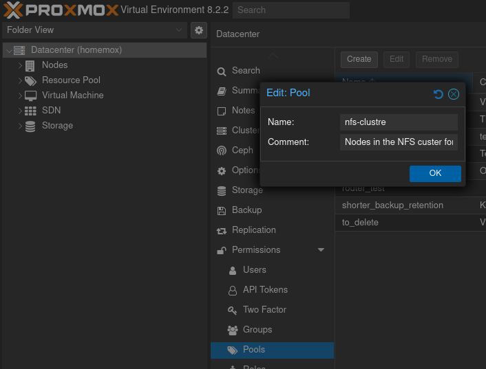

# Creating a Proxmox user for fencing

## Background

If you came here from [the guide on making a Linux cluster with pacemaker](./), then you already know why this page exists, and can skip to the next section.  For everyone else, a quick explanation.  We made a cluster and the nodes on the cluster need to be able to kill each other by talking to the proxmox host and forcing a reboot of the other node, so they can hopefully automatically recover from a bad state without any downtime. &#x20;

## Create the resource pool

The first step is to create a resource pool for the cluster servers.  This technically isn't required, but it is going to be the easy way to say what machines the user has permission to mess with. &#x20;

Click on the Datacenter (top of the tree on the left panel), and then expand "Permissions" and click on "Pools".  Click create, and name your new pool. &#x20;

<figure><figcaption>
Creating the resource pool in the Proxmox UI
</figcaption></figure>

## Create a group

Again this probably isn't technically necessary, but it is a good practice.  In the "Permissions" we are already in, click on the "Groups" section, and click "Add".  I called mine "nfs\_fence", and it's a good idea to put a comment in. &#x20;

## Create the user

Nothing really special here, make a user like normal.  Under the "Permissions" section we are already in, click "Users", and then click the "Add" button.  Fill in the username, etc. here.  I suggest putting in a comment to remind future you what this user is for "This user has limited permissions and should only be able to force a reboot of the nodes in the NFS cluster."  Add this user to the group created above. &#x20;

## Create a Role

Under the "Permissions" section we are already in, click "Roles", and click the "Create" button.  I named mine "nfs\_cluster\_fence".  The Privileges section is a multi-select drop-down list (a UI element I personally dislike).  I found I needed to select "VM.PowerMgmt" to let the user force a reboot, and needed "VM.Audit" and "VM.Monitor" for the fence script to find the VM and read its current state.  This is just a list of permissions. &#x20;

<figure><figcaption>
Creating the role
</figcaption></figure>

## Finally connect them all together&#x20;

Now we need to stitch these all together.  Click on the "Permissions" section (not one of its sub-headings), and click "Add", and select "group permission".  Here we will connect the user group to a set of permissions to grant, and a set of VMs to apply those permissions to.   So we will choose our new pool in the "Path" section, our new group in the "Group" section, and our new role in the "Role" section. &#x20;

<figure><figcaption>
Creating the Group Permission
</figcaption></figure>

And that should be it.  Put the VMs from the nfs cluster into the nfs\_cluster pool and the fencing should be able to work. &#x20;
